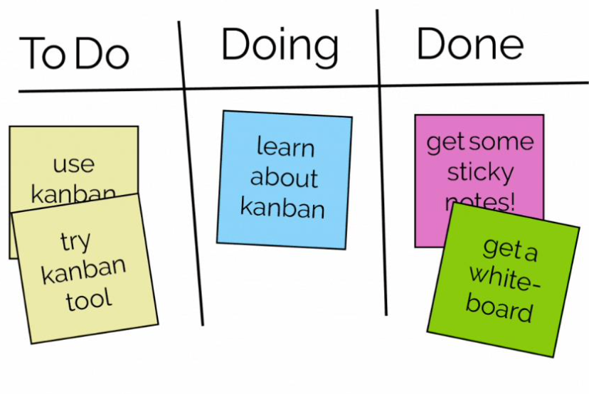
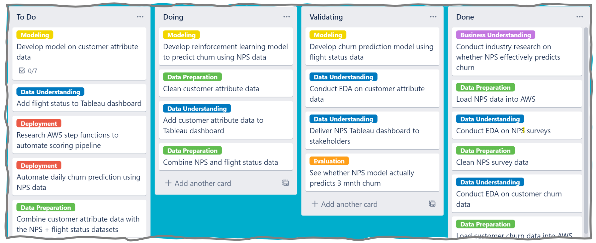
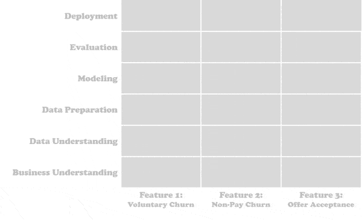
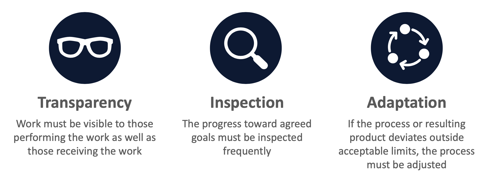
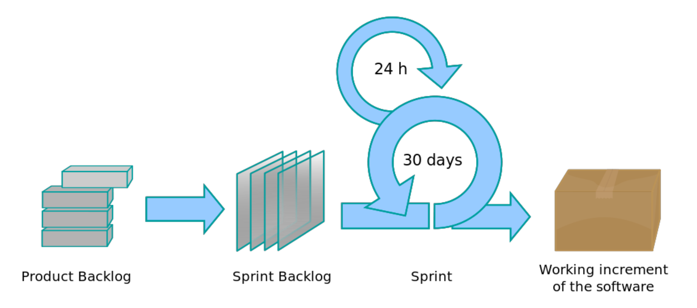

```{r setup, include=FALSE}
knitr::opts_chunk$set(echo = FALSE)
```

# Introduction

## Data Science Processes

A **data science process** includes:

1. data science workflow (e.g. CRISP-DM)
2. collaboration framework (e.g. Scrum)

The data science workflow provides the **what** and the collaboration framework provides the **how**. A popular example of a data science process is:

- **Microsoft**: Team Data Science Process (TDSP)

## Collaboration Framework

The *focus* of this presentation is on collaboration frameworks. The three most popular collaboration frameworks are:

1. Scrum
2. Kanban
3. TDSP

## Collaboration Framework

**Kanban** is a simple collaboration framework for allocating tasks (e.g. CRISP-DM tasks) and monitoring project progression. This collaboration framework is covered in two parts:

1. Kanban Overview
2. Kanban + CRISP-DM

**Scrum** for software development and **Data Driven Scrum** for data science are covered at the end. These frameworks could be too involved for NICD skills projects (to discuss). 

# Kanban

## Kanban Overview

Kanban is "billboard" in Japanese. It is a **board** based collaboration framework commonly used in software development. It is based on two principles:

1. Visualise the Flow
2. Limit WIP

## Kanban Overview

{width=60%}

A Kanban **board** contains **lists** (e.g. *To Do*, *Doing* and *Done*) that contain **tasks**. When a teams starts a task it is moved from the *To Do* list to the *Doing* list and when a team completes a task it is moved from the *Doing* list to the *Done* list.

## Kanban Overview

{width=60%}

- Uncompleted tasks are known as **work in progress** (WIP)
- WIP limits are the maximum number of uncompleted tasks

## Kanban Validation List

A Kanban *Validation* list is after the *Doing* list and before the *Done* list. Advantages:

- validating tasks generally improves the quality of the tasks completed and the project
- a task done by one team member can be validated by another. This could help distribute skills across the team.
- a task done by one or more team members can be validated by NICD. This could help identify learning opportunities.

## Kanban and CRISP-DM

{width=90%}

Tasks on the Kanban board can be tagged with the CRISP-DM **phase** (e.g. data preparation) they correspond to. This can help in communicating the progress of the project.

## Kanban and CRISP-DM

Waterfall approach delivers the features simultaneously:


## Kanban and CRISP-DM

Agile approach delivers the features sequentially:



## Kanban Benefits

- **Improves Communication**: highly visual and simple board, lists and flow of tasks
- **Enables Agility**: limits WIP to reduce time on uncompleted tasks and enables reprioritisation
- **No Time Box**: tasks do not require an estimation of time to completion
- **Adaptable**: no defined roles, meetings and artefacts so easy to integrate

## Kanban Challenges

- **Time?** Only add tasks to the *To Do* list that can be complete within the time between skills transfer sessions. Validation of these tasks could be done during preparation sessions.
- **Meetings?** Skills transfer sessions every one or two weeks could be supplemented with a project review session after each phase is complete? 
- **Roles?** One team member could be given the responsibility to allocate tasks?

# Scrum

## Scrum Pillars

The **empirically** developed scrum pillars are:

{width=100%}

## Scrum Framework

{width=90%}

The scrum workflow has three **roles**, five **events** and three **artefacts**. It can also be integrated with Kanban. You can learn about scrum at [scrum.org](https://www.scrum.org/resources/what-is-scrum). 

